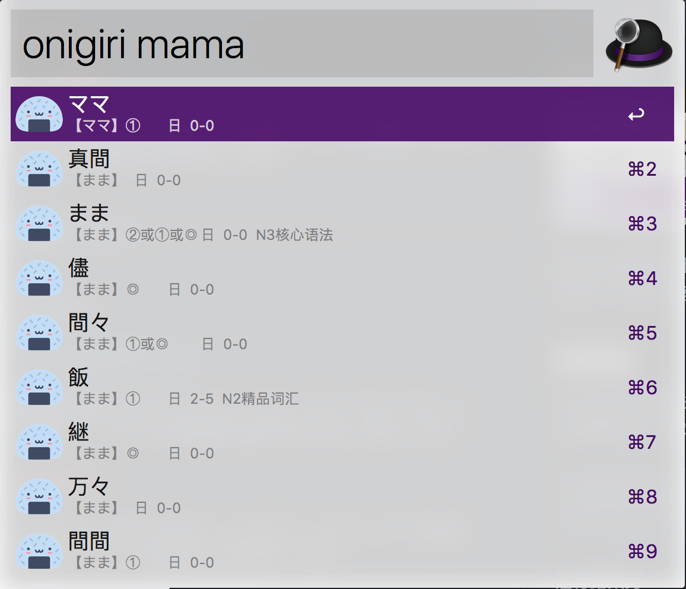
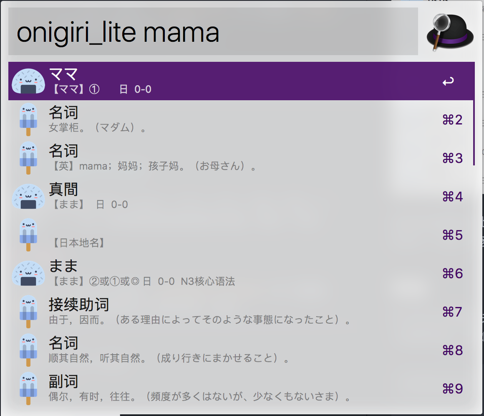

# Onigiri 饭团日语词典

饭团日语词典 是 Alfred 3 的一个 Workflow，用于快速查询日语单词（ 日 -> 中 ），查询结果除基本信息外，还包含读音与例句等。

## 用法

### 完全版

在 Alfred 中输入关键词 **onigiri** 或快捷键 **Cmd + O**，空格后加上查询内容，例如：

```
onigiri mama
```

运行结果为：



### 简版

在 Alfred 中输入关键词 **onigiri_lite** 或 快捷键 **Alt + l**，空格后加上查询内容，例如：

```
onigiri_lite mama
```

运行结果为：



### 其他

在选择项目上按下 Enter、Ctrl、Alt、Cmd、Cmd + L 与 CMD + L 等，来获得帮助或使用更多功能，尝试一下吧！

希望，这个小工具能够帮助到和我一样喜欢日语的您，(///▽///)

### 免责声明

*   词典数据来源于 [沪江小D]('http://dict.hjenglish.com/jp/jc')，仅用于个人学习交流使用
*   在使用过程中，程序会将用户的查询结果缓存起来（本地缓存 + 服务器缓存），但不会上传查词结果之外任何用户数据
*   Dependent on [lxml](http://lxml.de). The lxml library is shipped under a **[BSD license](https://github.com/lxml/lxml/blob/master/doc/licenses/BSD.txt)**. libxml2 and libxslt2 itself are shipped under the **[MIT license](http://www.opensource.org/licenses/mit-license.html)**. There should therefore be no obstacle to using lxml in your codebase.
*   <div>Icons made by <a href="http://www.freepik.com" title="Freepik">Freepik</a> from <a href="http://www.flaticon.com" title="Flaticon">www.flaticon.com</a> is licensed by <a href="http://creativecommons.org/licenses/by/3.0/" title="Creative Commons BY 3.0" target="_blank">CC 3.0 BY</a></div>
* Current version 1.1
